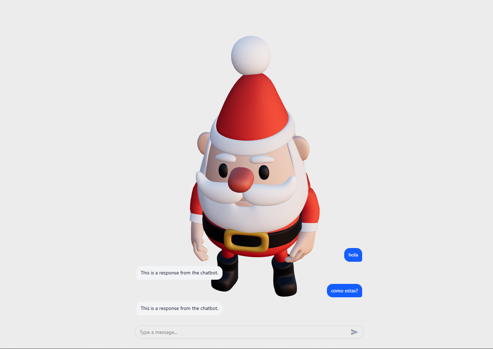

# SantaChat 3D
Aplicacion de chatbot con IA que combina una interfaz conversacional y un avatar 3D en tiempo real usando React Three Fiber (R3F). El proyecto integra un personaje tipo Santa en formato GLB, animaciones, y lipsync basado en audio para que la experiencia se sienta viva mientras conversas.

**Vista previa**


**Que hace el proyecto**
- Muestra un avatar 3D con entorno y controles de orbita.
- Renderiza un chat en primer plano con mensajes de usuario y bot.
- Gestiona el estado del chat con Zustand.
- Prepara un flujo de lipsync con audio usando `wawa-lipsync` y morph targets del modelo.

**Como funciona (resumen tecnico)**
- La escena 3D vive en un `Canvas` de R3F y el chat en una capa UI aparte.
- `Character` carga el modelo `Santa.glb`, reproduce la animacion `Idle` y actualiza los visemes en cada frame.
- `useChatbot` centraliza mensajes, estado de carga y reproduce audio para sincronizar labios.
- La respuesta del bot es un placeholder; ahi es donde se conecta tu API de IA.

**Estructura rapida**
- `src/App.jsx`: layout principal (UI + Canvas 3D).
- `src/components/Character.jsx`: carga del modelo, animaciones y lipsync.
- `src/components/UI.jsx`: interfaz del chat.
- `src/hooks/useChatbot.js`: estado global, envio de mensajes y audio.
- `public/models/`: modelos 3D (GLB).

**Instalacion y desarrollo**
```bash
yarn
yarn dev
```

**Scripts**
- `yarn dev`: entorno de desarrollo.
- `yarn build`: build de produccion.
- `yarn preview`: vista previa del build.

**Personalizacion rapida**
- Cambia el modelo 3D en `public/models/` y ajusta `Character.jsx` si el nombre de animacion o visemes es distinto.
- Conecta tu backend de IA reemplazando el `setTimeout` en `src/hooks/useChatbot.js` por una llamada real.
- Si tu IA devuelve audio TTS, pasa la URL al `playAudio()` para activar el lipsync.
